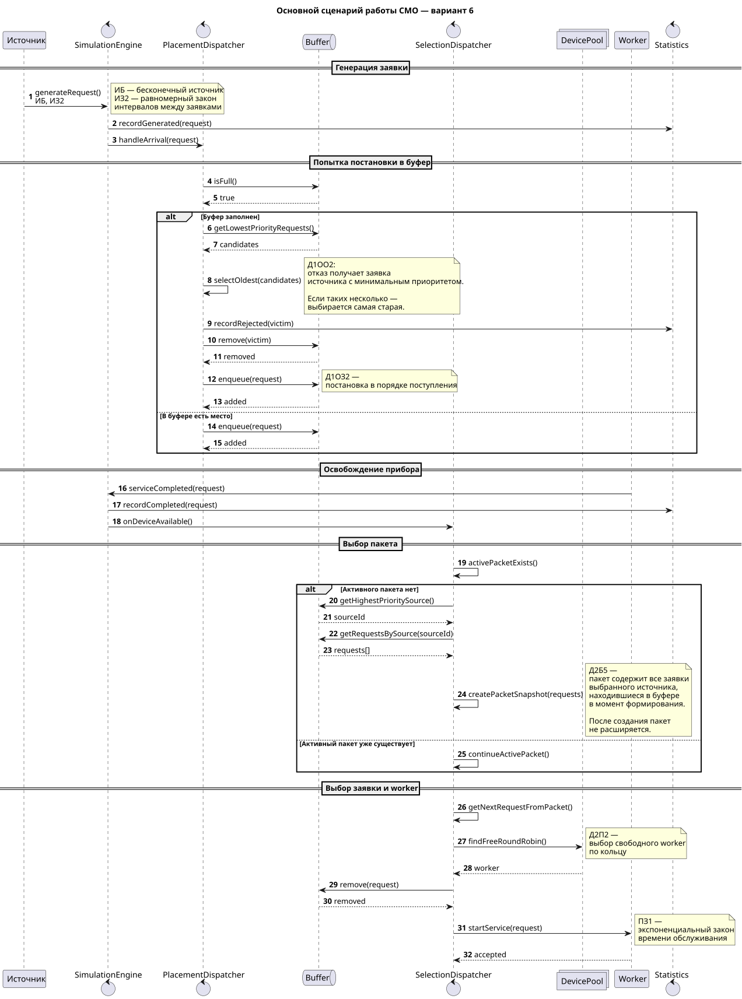
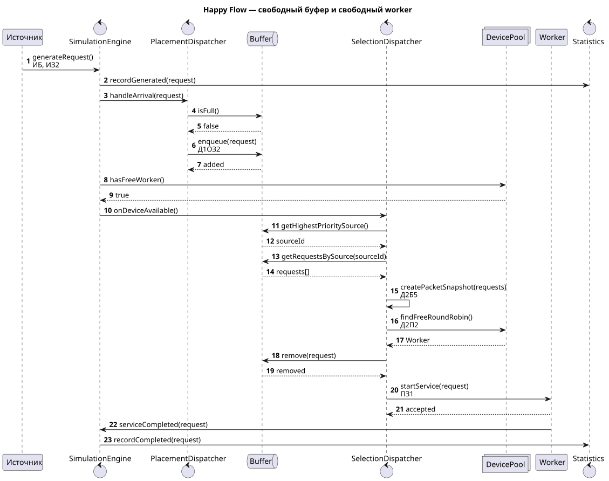
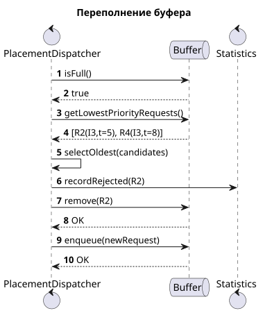
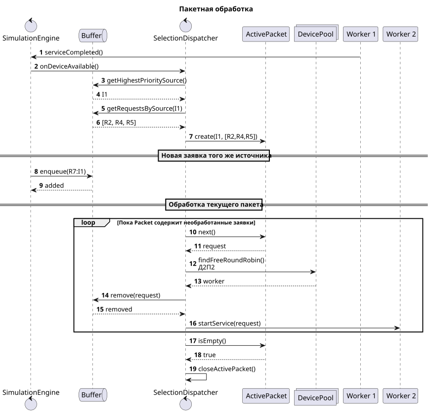
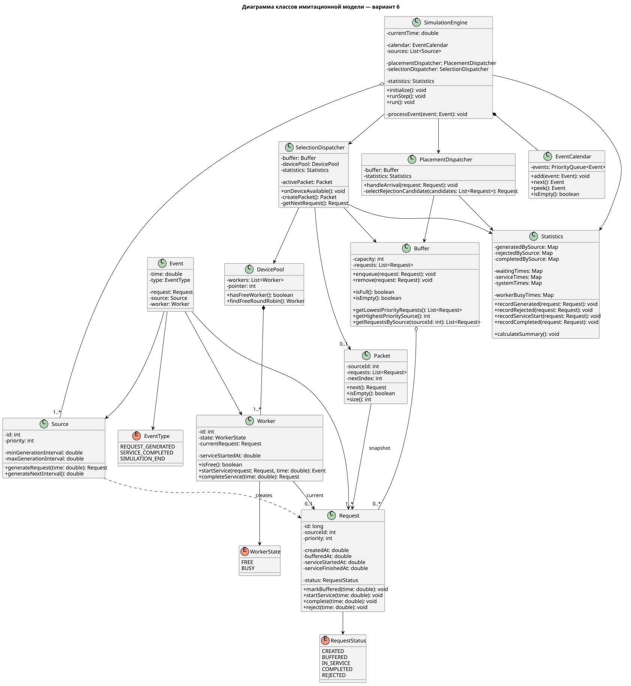
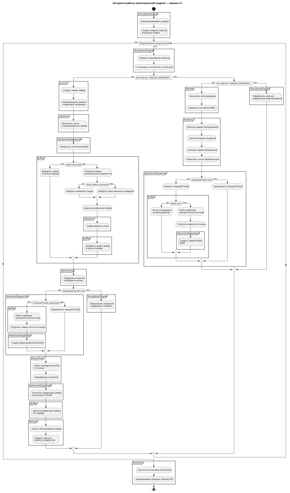

# Информационная система управления бронированием студенческого коворкинга — Вариант 6
 ```text
ИБ  ИЗ2  ПЗ1  Д1ОЗ2  Д1ОО2  Д2П2  Д2Б5  ОР1  ОД3
```
## Первичные артефакты

В модели:
- источники СМО — категории пользователей, формирующие запросы на бронирование;
- заявка — запрос на бронирование ресурса коворкинга;
- буфер — общая ограниченная очередь ожидающих запросов;
- приборы СМО — **worker-процессы серверной части**, обрабатывающие заявки;
- диспетчер постановки управляет размещением заявок в буфере и отказами;
- диспетчер выбора формирует пакет заявок и назначает их свободным worker-процессам;
- статистика используется для формирования итоговых показателей моделирования.

| Код | Значение в варианте |
|---|---|
| **ИБ** | Бесконечные источники заявок |
| **ИЗ2** | Равномерный закон распределения интервалов между генерациями заявок |
| **ПЗ1** | Экспоненциальный закон распределения времени обслуживания |
| **Д1ОЗ2** | Постановка заявки в буфер в порядке поступления; новая заявка помещается в конец очереди |
| **Д1ОО2** | При переполнении буфера отказ получает заявка источника с наименьшим приоритетом |
| **Д2П2** | Выбор свободного прибора по кольцу |
| **Д2Б5** | Выбор заявок на обслуживание пакетами по приоритету источника |
| **ОР1** | Автоматический режим: сводная таблица результатов |
| **ОД3** | Пошаговый режим: временные диаграммы и текущее состояние системы |

## Бизнес-домен
Моделируется информационная система управления бронированием ресурсов студенческого коворкинга.
Используются три источника заявок:

| Источник | Категория заявок | Приоритет |
|---|---|---:|
| **И1** | Учебные и проектные группы | 1 — наивысший |
| **И2** | Студенческие объединения и команды | 2 |
| **И3** | Индивидуальные заявки студентов | 3 — наименьший |

Порядок приоритетов:
```text
И1 > И2 > И3
```
Заявка содержит данные, необходимые для обработки запроса на бронирование: идентификатор, источник, пользователя, выбранный ресурс, требуемый временной интервал, момент поступления и текущее состояние.

## Основная логика СМО
```text
Источник
   |
   v
SimulationEngine
   |
   v
PlacementDispatcher
   |
   v
Buffer
   |
   v
SelectionDispatcher
   |
   v
DevicePool
   |
   v
Worker
```

### Постановка в буфер — Д1ОЗ2
Если заявка поступает в систему, она помещается в конец общей очереди в порядке поступления.
При удалении заявки из середины очереди последующие элементы сдвигаются, сохраняя порядок.

### Переполнение и отказ — Д1ОО2
Если буфер заполнен, определяется заявка источника с наименьшим приоритетом среди уже находящихся в очереди.
Для данного бизнес-домена:
```text
И1 > И2 > И3
```
Поэтому в первую очередь кандидатом на отказ является заявка источника `И3`, затем `И2`, затем `И1`.
Если заявок минимального приоритета несколько, используется дополнительное правило модели: **отказ получает наиболее старая из них**.
После удаления отказавшей заявки новая заявка помещается в конец очереди.

### Пакетная выборка — Д2Б5
При освобождении прибора диспетчер выбора определяет наиболее приоритетный источник, заявки которого находятся в буфере.
После этого формируется пакет из **всех заявок выбранного источника, находившихся в буфере в момент формирования пакета**.
Сформированный пакет фиксируется и **не расширяется**. Если новая заявка того же источника поступила позже, она остаётся в буфере и может попасть только в следующий пакет.
Все приборы обслуживают текущий пакет до его завершения. После этого может быть сформирован новый пакет.

### Выбор прибора — Д2П2
Свободный worker выбирается по кольцу.
`DevicePool` хранит указатель на позицию, с которой начинается очередной поиск свободного прибора. После назначения заявки указатель перемещается на следующую позицию.

### Обслуживание — ПЗ1
Worker-процесс обслуживает одну заявку за раз.
Время обслуживания задаётся экспоненциальным законом распределения. После окончания обслуживания worker становится свободным, а событие освобождения прибора запускает дальнейший выбор заявок.

---
# Первичные артефакты
## Sequence Diagrams
### Основной сценарий

Основной сиквенс объединяет ключевые ветки варианта:
- генерацию заявки;
- постановку в буфер;
- переполнение буфера;
- отказ по `Д1ОО2`;
- освобождение прибора;
- формирование пакета по `Д2Б5`;
- выбор прибора по `Д2П2`;
- передачу заявки на обслуживание;
- завершение обслуживания.


Исходник: [`docs/diagrams/sequence/main-flow.puml`](docs/diagrams/sequence/main-flow.puml)

### Happy Flow

Исходник: [`docs/diagrams/sequence/happy-flow.puml`](docs/diagrams/sequence/happy-flow.puml)

### Переполнение буфера
Отдельный случай, когда:
- `Д1ОЗ2` — постановки в буфер;
- `Д1ОО2` — выбора заявки для отказа;
- дополнительного правила выбора самой старой заявки при одинаковом минимальном приоритете.

Исходник: [`docs/diagrams/sequence/overflow.puml`](docs/diagrams/sequence/overflow.puml)

### Пакетная обработка
Диаграмма показывает работу `Д2Б5` и `Д2П2`:
- формирование пакета;
- фиксацию состава пакета;
- невозможность его расширения новыми заявками;
- обработку заявок текущего пакета;
- кольцевой выбор worker-процесса.

Исходник: [`docs/diagrams/sequence/package-processing.puml`](docs/diagrams/sequence/package-processing.puml)

---
## Диаграмма классов
Основные классы:
| Класс | Назначение |
|---|---|
| `Request` | Заявка на бронирование |
| `Source` | Генератор заявок конкретного источника |
| `Buffer` | Ограниченная очередь заявок |
| `PlacementDispatcher` | Постановка заявок в буфер и организация отказа |
| `SelectionDispatcher` | Формирование пакетов и выбор заявки на обслуживание |
| `Packet` | Зафиксированная группа заявок одного источника |
| `DevicePool` | Набор worker-процессов и кольцевой указатель |
| `Worker` | Прибор СМО, выполняющий обслуживание |
| `Event` | Особое событие модели |
| `EventCalendar` | Календарь событий |
| `SimulationEngine` | Координация модельного времени и обработка событий |
| `Statistics` | Сбор статистических показателей |


Исходник: [`docs/diagrams/class/class-diagram.puml`](docs/diagrams/class/class-diagram.puml)

---
## Flowchart с дорожками
Flowchart описывает алгоритм обработки особых событий и распределяет действия по компонентам модели.
В диаграмме отражены основные альтернативы:
- тип текущего события;
- заполненность буфера;
- выбор заявки для отказа;
- наличие свободного worker;
- наличие активного пакета;
- завершение активного пакета;
- наличие заявок в буфере;
- завершение моделирования.


Исходник: [`docs/diagrams/flowchart/system-flow.puml`](docs/diagrams/flowchart/system-flow.puml)
